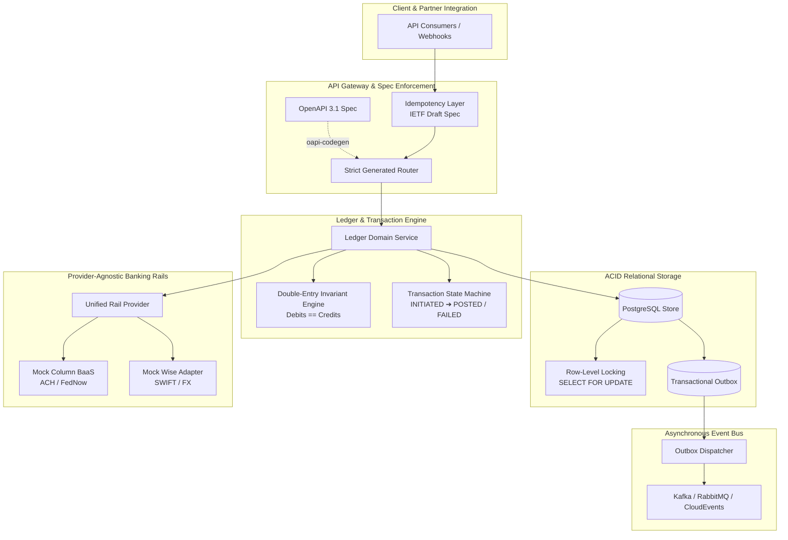

# ApexLedger ⚡

[](https://golang.org)
[](https://openapis.org)
[](https://opensource.org/licenses/MIT)

> **Production-grade, spec-driven core banking ledger and money-movement engine built in Go.**
> Engineered to demonstrate financial infrastructure fundamentals: strict double-entry invariants ($\sum \text{debits} - \sum \text{credits} = 0$), deterministic concurrency controls, IETF `Idempotency-Key` guarantees, provider-agnostic banking rail adapters (BaaS), and transactional outbox patterns.

---

## 🏛️ System Architecture



---

## 🎯 Key Architectural Hallmarks

1. **Spec-Driven Development (SDD):**
   - The OpenAPI 3.1 specification (`api/openapi/v1/ledger.yaml`) is the single source of truth.
   - Router interfaces, request/response DTOs, and field validations are generated via `oapi-codegen` without manual glue code.
2. **Double-Entry Accounting Invariant:**
   - Every movement of money is represented by balanced ledger lines.
   - Currency amounts are stored in **minor integer units** (e.g., cents, pence) to prevent floating-point inaccuracies.
3. **Deterministic Concurrency & Zero Double-Spending:**
   - Account balances are safeguarded by row-level locking (`SELECT ... FOR UPDATE`) and atomic database transactions.
   - Verified by an automated 100-goroutine concurrent stress test.
4. **Strict Idempotency:**
   - Enforces IETF `Idempotency-Key` headers on all mutating endpoints. Concurrent duplicate requests are locked and deduplicated; cached responses are served deterministically.
5. **Provider-Agnostic Banking Rails:**
   - Decoupled from single-provider lock-in. Switching or multi-homing banking partners (e.g. Column, Unit, Stripe Treasury, Wise) requires only a swappable adapter.
6. **Transactional Outbox:**
   - Ensures that domain events are written atomically with ledger state changes, eliminating dual-write distributed failure modes.

---

## 🚀 Getting Started

### Prerequisites
- Go 1.22+
- Make

### Quickstart

```bash
# Clone the repository
git clone https://github.com/akmalkhaniub/apex-ledger.git
cd apex-ledger

# Run tests
make test

# Run race condition and concurrency stress tests
make test-race

# Build and run the server
make run
```

---

## 📜 API Specification

Inspect the contract in `api/openapi/v1/ledger.yaml`.
Includes endpoints for:
- `POST /v1/accounts` (Create accounts with classification: `ASSET`, `LIABILITY`, `EQUITY`, `REVENUE`, `EXPENSE`)
- `GET /v1/accounts/{id}` (Get account metadata)
- `GET /v1/accounts/{id}/balance` (Fetch real-time computed balance)
- `POST /v1/transfers` (Execute multi-line double-entry transfers with `Idempotency-Key`)
- `GET /v1/transfers/{id}` (Fetch transfer state and ledger entries)

---

## 🧪 Verification & Invariant Testing

Run the stress test suite:
```bash
go test -v -race -run TestConcurrentDoubleSpend ./tests/...
```
